# dappa-vlops-maze-planning

This repository presents a post-processing framework combining the Direction-Aware Path Planning Approach (DAPPA) and Visibility and Line-of-Sight Path Simplification (VLoPS) for UAV-assisted UGV path planning in grid-based environments.

# Direction-Aware and Line-of-Sight Path Planning for UAV-Assisted UGV Navigation 

This repository provides a lightweight and efficient framework that integrates the **Direction-Aware Path Planning Approach (DAPPA)** and **Visibility and Line-of-Sight Path Simplification (VLoPS)** to systematically refine paths generated by classical graph-based planners. The objective is to improve path quality by enhancing smoothness, reducing unnecessary turns, and shortening trajectories, **without introducing significant computational overhead**.

Unlike learning-based methods that require large datasets and extensive training, this approach improves the reliability and generalizability of classical algorithms such as **A\***, **Dijkstra**, **BFS**, and **DFS**, with minimal additional complexity. The proposed methods are evaluated on both synthetic maze datasets and UAV-derived real-world datasets.

---

## Key Features

- Post-processes any initial path generated by classical algorithms.
- Removes redundant waypoints and smoothens abrupt turns.
- Shortens paths using axis-aligned visibility checks.
- Imposes **minimal computational overhead**.
- Does not require training data or model fine-tuning.
- Applicable to both **synthetic benchmark datasets** and **real-world semantically segmented maps**.
- Tested on high-resolution maze datasets and real UAV-derived datasets (e.g., Göttingen Maze Dataset, MBRSC Dubai Aerial Dataset, ISPRS Urban Semantic Dataset, UAVid Dataset).

---

## Algorithmic Pipeline

1. **Initial Path Generation**  
   Generate an initial feasible path using classical graph search algorithms such as A*, Dijkstra, BFS, or DFS.

2. **Visibility and Line-of-Sight Path Simplification (VLoPS)**  
   Simplify the path by eliminating intermediate waypoints along straight, obstacle-free, axis-aligned segments based on line-of-sight checks.

3. **Direction-Aware Path Planning Approach (DAPPA)**  
   Further refine the path by systematically removing unnecessary turning points through local directionality analysis.

4. **Execution**  
   The final simplified path can be directly used for navigation in structured or real-world environments.

---

## Algorithmic Overview

### Visibility and Line-of-Sight Path Simplification (VLoPS)

**Purpose**  
Remove redundant waypoints along straight, obstacle-free segments to produce a shorter, more direct trajectory.

**Method**  
- Iteratively check the visibility between the current waypoint and the farthest possible waypoint along horizontal or vertical alignment.
- Eliminate intermediate waypoints if the visibility condition is satisfied.

**Benefits**  
- Shortens path length.
- Retains path feasibility while simplifying navigation.

---

### Direction-Aware Path Planning Approach (DAPPA)

**Purpose**  
Refine the path by reducing unnecessary directional changes and eliminating redundant waypoints.

**Method**  
- Evaluate sequences of three consecutive points.
- Identify whether the intermediate point introduces an unnecessary turn.
- Remove or adjust the point to improve smoothness and efficiency.

**Benefits**  
- Reduces mechanical movement.
- Improves path optimality and execution efficiency.

---

## Dataset Preparation and Modification

To comprehensively evaluate the proposed framework, both synthetic and real-world datasets were prepared and modified as detailed below. These datasets ensure that the evaluation captures both controlled experimental settings and realistic navigation scenarios derived from UAV imagery.

### Synthetic Maze Datasets

A large synthetic maze dataset was generated to provide controlled, reproducible, and diverse grid-based environments for benchmarking. The dataset contains **6,000 maze images**, covering four grid resolutions: 10x10, 30x30, 50x50, and 100x100. These mazes are designed to simulate challenging navigation tasks with varying levels of complexity and obstacle density, making them ideal for testing both classical path planning algorithms and the proposed post-processing techniques.

In addition to this custom-generated dataset, the publicly available **Göttingen Maze Dataset** \[1\] was used as a benchmark. This dataset is widely adopted in the path planning research community and serves as a standard reference for evaluating maze navigation performance.

### Real-World UAV-Derived Datasets

To validate the applicability of the proposed framework in realistic settings, three **publicly available, semantically segmented aerial datasets** were adapted for grid-based path planning experiments. These datasets originate from UAV imagery captured in complex urban and suburban environments:

- **MBRSC Dubai Aerial Dataset** \[2\] - high-resolution UAV imagery annotated with semantic labels representing diverse urban features.
- **ISPRS Urban Semantic Dataset** \[3\] - detailed urban scenes with fine-grained semantic annotations.
- **UAVid Dataset** \[4\] - UAV-based dataset focused on street-level and urban scenarios.

Since the original datasets were provided as semantic segmentation maps, a preprocessing step was performed to convert them into **binary occupancy grids**. In this conversion, pixels corresponding to navigable (free-space) classes were mapped to `1`, while those representing obstacles or non-traversable areas were mapped to `0`. This binary representation enabled the use of these real-world datasets in grid-based path planning experiments, making the evaluation consistent across both synthetic and real-world scenarios.

### Dataset References

\[1\] Computational Neuroscience Group, University of Göttingen — Göttingen Maze Dataset: [https://alexandria.physik3.uni-goettingen.de/cns-group/datasets/path_planning/](https://alexandria.physik3.uni-goettingen.de/cns-group/datasets/path_planning/)  
\[2\] MBRSC Dubai Aerial Dataset: Humans in the Loop — [https://www.kaggle.com/datasets/humansintheloop/semantic-segmentation-of-aerial-imagery](https://www.kaggle.com/datasets/humansintheloop/semantic-segmentation-of-aerial-imagery/)  
\[3\] ISPRS Urban Semantic Dataset: [https://www.isprs.org/resources/datasets/benchmarks/UrbanSemLab/default.aspx](https://www.isprs.org/resources/datasets/benchmarks/UrbanSemLab/default.aspx)  
\[4\] UAVid Dataset: [https://www.kaggle.com/datasets/dasmehdixtr/uavid-v1](https://www.kaggle.com/datasets/dasmehdixtr/uavid-v1)

---

# Results Overview

This section presents the path planning and smoothing results for both **10×10**, **15×15** and **100×100** grid environments using different algorithms and techniques.

---

## 10×10 Grid

### Dijkstra-Based Paths

| Dijkstra | + VLoPS | + DAPPA | + Bézier Curve Smoothing |
|:--------:|:---------------------------:|:------------------:|:------------------:|
| 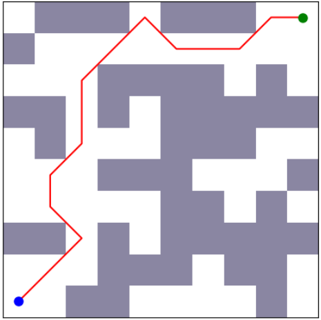 | 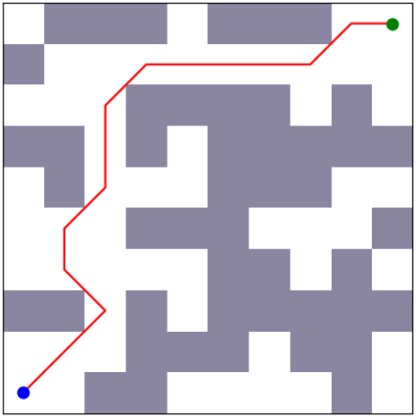 |  |  |

### A*-Based Paths

| A* | + VLoPS | + DAPPA | + Bézier Curve Smoothing |
|:--------:|:---------------------------:|:------------------:|:------------------:|
| 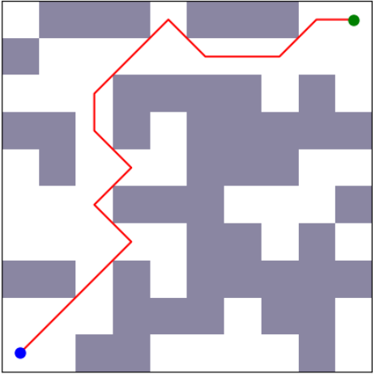 | 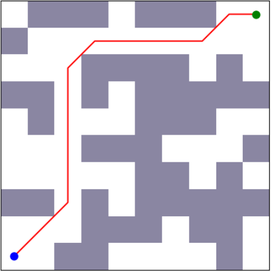 |  |  |

---

## 15×15 Grid

### Dijkstra-Based Paths

| Dijkstra | + VLoPS | + DAPPA | + Bézier Curve Smoothing |
|:--------:|:---------------------------:|:------------------:|:------------------:|
|  | 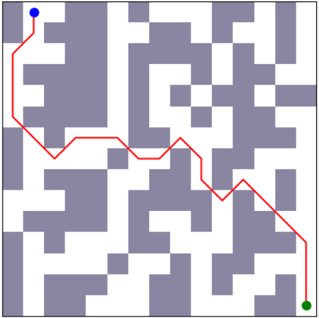 | 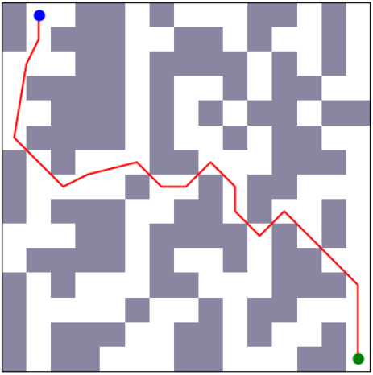 | 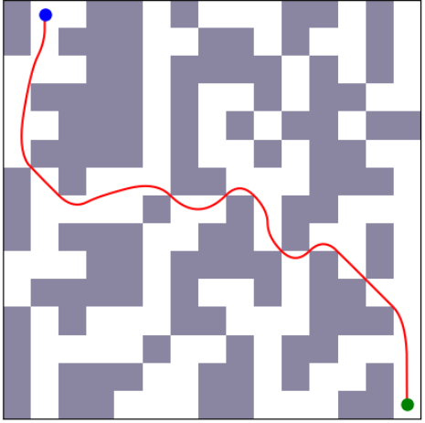 |

### A*-Based Paths

| A* | + VLoPS | + DAPPA | + Bézier Curve Smoothing |
|:--------:|:---------------------------:|:------------------:|:------------------:|
| 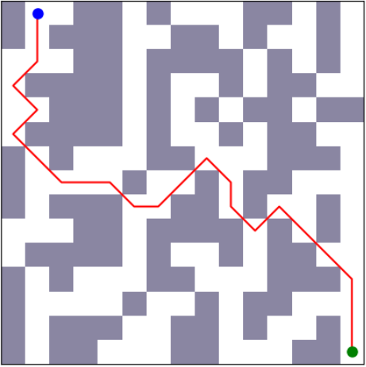 | 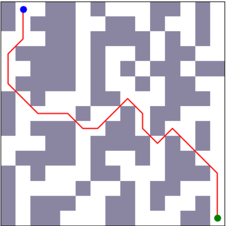 |  |  |

---

## 100×100 Grid

### Dijkstra-Based Paths

| Dijkstra | + VLoPS | + DAPPA | + Bézier Curve Smoothing |
|:--------:|:---------------------------:|:------------------:|:------------------:|
| 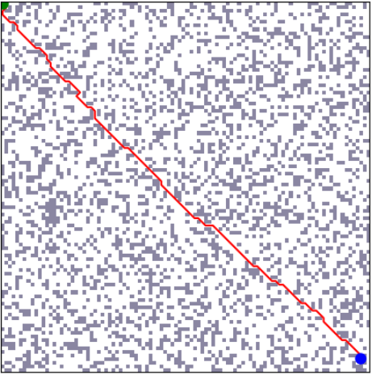 |  |  | 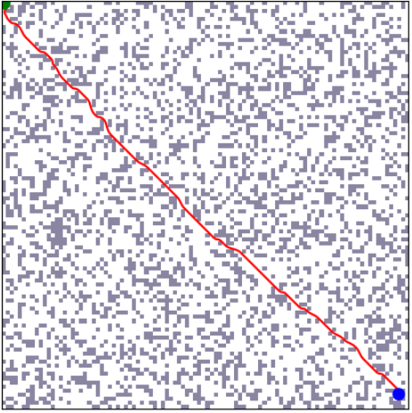 |

### A*-Based Paths

| A* | + VLoPS | + DAPPA | + Bézier Curve Smoothing |
|:--------:|:---------------------------:|:------------------:|:------------------:|
| 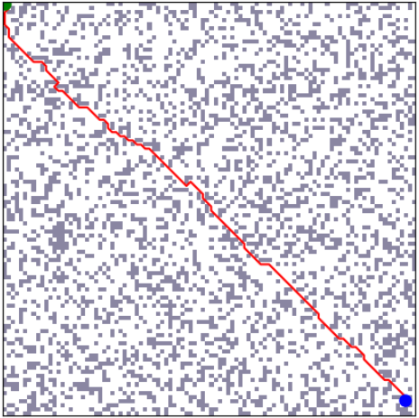 |  | 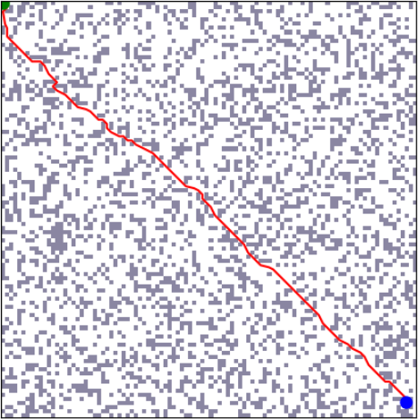 | 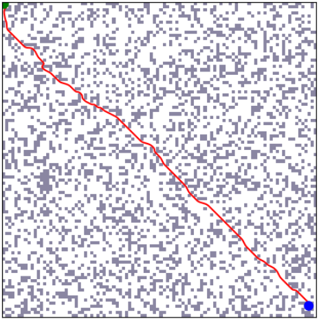 |

---

## Citation

If you use this repository in your research or development work, please cite it using the following:

```bibtex
@misc{munasinghe2025dappa,
  author       = {Isuru Munasinghe},
  title        = {DAPPA-VLoPS Maze Planning},
  year         = {2025},
  publisher    = {GitHub},
  howpublished = {\url{https://github.com/IsuruMunasinghe98/dappa-vlops-benchmark-datasets}},
  note         = {Accessed: 2025-06-20}
}
