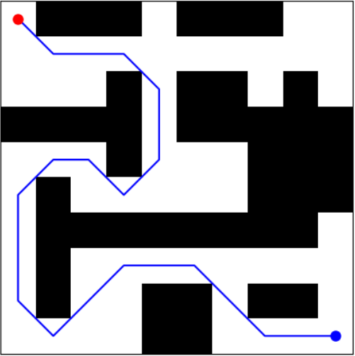
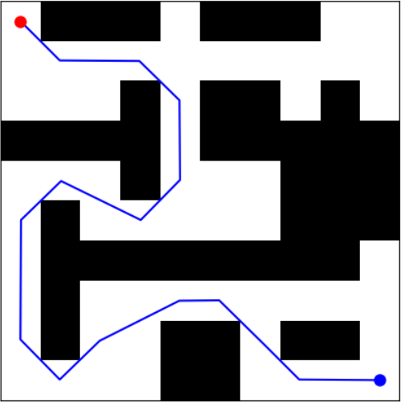
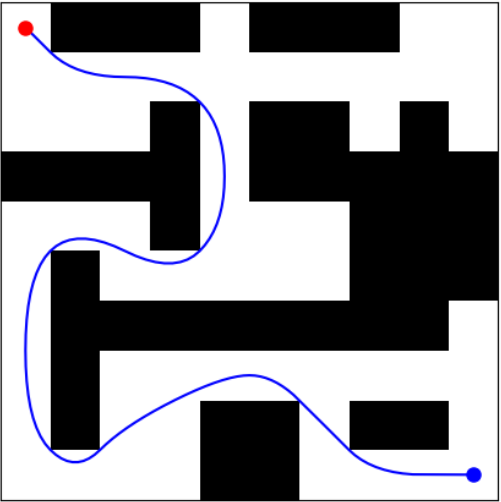
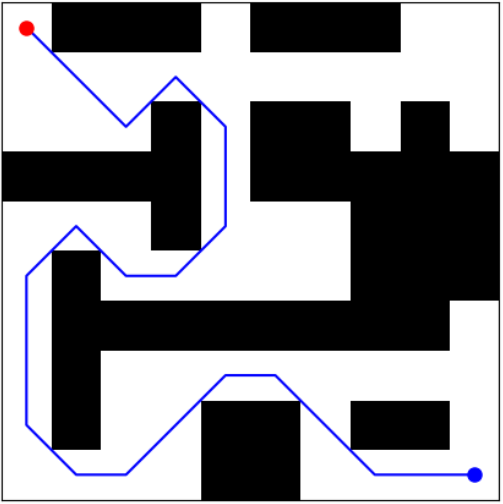
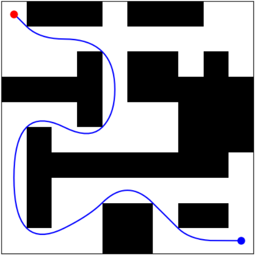
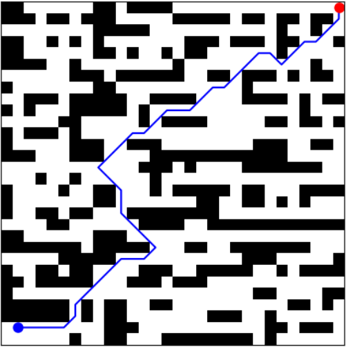
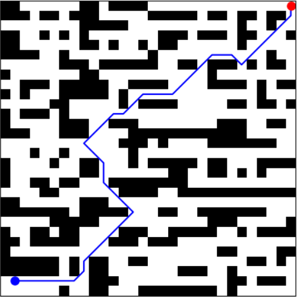
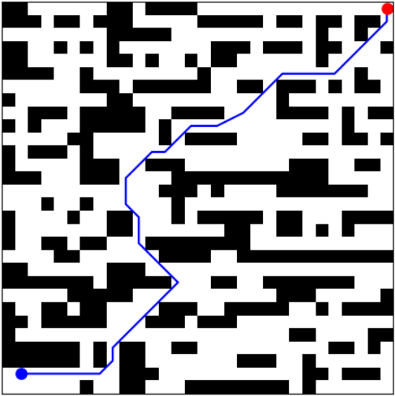

# dappa-clospo-maze-planning
This repository presents a post-processing framework combining the Direction-Aware Path Planning Approach (DAPPA) and Constrained Line-of-Sight Path Optimization (CLOSPO).

# Direction-Aware and Line-of-Sight Constrained Path Planning for Maze Traversal

This repository presents a lightweight, efficient framework combining **Direction-Aware Path Planning Approach (DAPPA)** and **Constrained Line-of-Sight Path Optimization (CLOSPO)** to systematically refine paths generated by classical graph-based planners. The objective is to enhance path quality, improving smoothness, reducing unnecessary turns, and shortening trajectories, **without introducing significant computational overhead**.

Unlike learning-based methods that require large datasets and heavy training, this approach enhances the reliability and generalizability of classical algorithms such as **A\***, **Dijkstra**, **BFS**, and **DFS** with minimal additional complexity.

---

## Key Features

- Post-processes any initial path generated by classical algorithms.
- Removes redundant waypoints and smoothens abrupt turns.
- Shortens paths using constrained visibility checks.
- Applies multiple **trajectory smoothing** methods:
    - P-Controller Based Smoothing
    - Quadratic Bézier Curve Smoothing
    - Rational Quadratic Bézier Curve Smoothing
- Imposes **minimal computational overhead**.
- No requirement for training data or model fine-tuning.
- Scalable to **arbitrary maze sizes**.
- Tested in high-resolution maze environments and validated through Webots simulation.

---

## Algorithmic Pipeline

1. **Initial Path Generation**  
   Generate an initial feasible path using classical graph search algorithms like A*, Dijkstra, BFS, or DFS.

2. **Direction-Aware Path Planning Approach (DAPPA)**  
   Refine the path by systematically removing unnecessary turning points based on local directionality checks.

3. **Constrained Line-of-Sight Path Optimization (CLOSPO)**  
   Further shorten and simplify the path by skipping intermediate waypoints when direct line-of-sight is available under constrained movement rules.

4. **Trajectory Smoothing**  
   Apply smoothing techniques to the refined path:
   - **P-Controller Based Smoothing:** Simple proportional control-based path fitting to reduce oscillations and correct sharp deviations.
   - **Bézier Curve Smoothing:** Fit a cubic Bézier curve through the path points for smooth polynomial interpolation.
   - **Rational Quadratic Bézier Curve Smoothing:** More flexible Bézier variant allowing weighted control points for even finer control of curve shape and path curvature.

5. **Execution**  
   The final smoothed path can be directly used for robot motion execution in simulation or real environments.
---

## Algorithmic Overview

### Direction-Aware Path Planning Approach (DAPPA)

**Purpose**  
Refine the path by reducing unnecessary directional changes and removing redundant waypoints.

**Method**  
- Traverse through each sequence of three consecutive points.
- Identify if the direction remains unchanged between the segments.
- Eliminate the middle point if the trajectory is linear.

**Benefits**  
- Reduces unnecessary mechanical movement.
- Improves path optimality and travel efficiency.

---

### Constrained Line-of-Sight Path Optimization (CLOSPO)

**Purpose**  
Further streamline the path by directly connecting waypoints that are visible to each other under constrained movement checks.

**Method**  
- Check the line-of-sight between non-consecutive points.
- Skip intermediate nodes if the path between them is obstacle-free.
- Ensure no collisions by performing grid-cell visibility validation.

**Benefits**  
- Shortens the total path length.
- Produces continuous trajectories better suited for robotic systems.

---

# Results Overview

This section presents the path planning and smoothing results for both **10×10** and **30×30** grid environments using different algorithms and techniques.

---

## 10×10 Grid

### Dijkstra-Based Paths

| Dijkstra | Simplified (CLOSPO + DAPPA) | After P Controller | Quadratic Bézier | Rational Quadratic Bézier |
|:--------:|:---------------------------:|:------------------:|:----------------:|:-------------------------:|
|  |  |  |  |  |

### A*-Based Paths

| A* | Simplified (CLOSPO + DAPPA) | After P Controller | Quadratic Bézier | Rational Quadratic Bézier |
|:--------:|:---------------------------:|:------------------:|:----------------:|:-------------------------:|
|  |  |  |  |  |

---

## 30×30 Grid

### Dijkstra-Based Paths

| Dijkstra | Simplified (CLOSPO + DAPPA) | After P Controller | Quadratic Bézier | Rational Quadratic Bézier |
|:--------:|:---------------------------:|:------------------:|:----------------:|:-------------------------:|
|  |  |  |  |  |

### A*-Based Paths

| A* | Simplified (CLOSPO + DAPPA) | After P Controller | Quadratic Bézier | Rational Quadratic Bézier |
|:--------:|:---------------------------:|:------------------:|:----------------:|:-------------------------:|
|  |  |  |  |  |

---

## Robot Traversal Simulation Results

This includes Webots simulation of the e-puck robot navigating a 10×10 maze using:

- **Left**: Standard A* algorithm  
- **Right**: Optimized path using DAPPA + CLOSPO + Bézier smoothing

<div align="center">
  <span style="display: inline-block; margin-right: 10px;">
    
  </span>
  <span style="display: inline-block;">
    
  </span>
</div>
---

## Citation

If you use this repository in your research or development work, please cite it using the following:

```bibtex
@misc{munasinghe2025dappa,
  author       = {Isuru Munasinghe},
  title        = {DAPPA-CLOSPO Maze Planning},
  year         = {2025},
  publisher    = {GitHub},
  howpublished = {\url{https://github.com/IsuruMunasinghe98/dappa-clospo-maze-planning}},
  note         = {Accessed: 2025-04-30}
}
